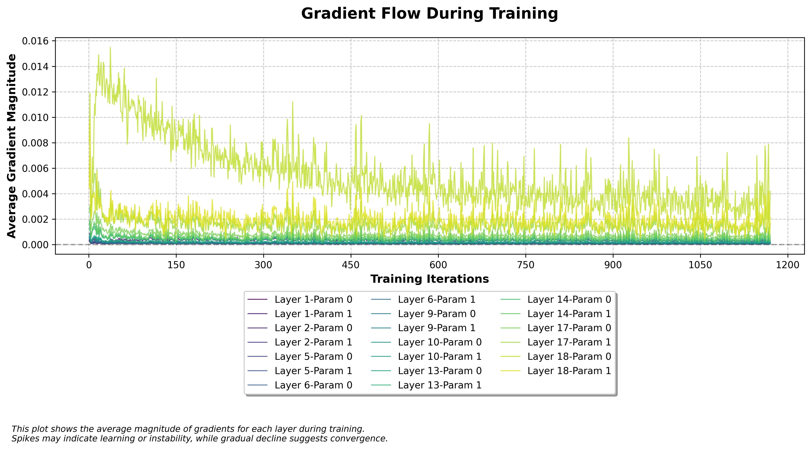
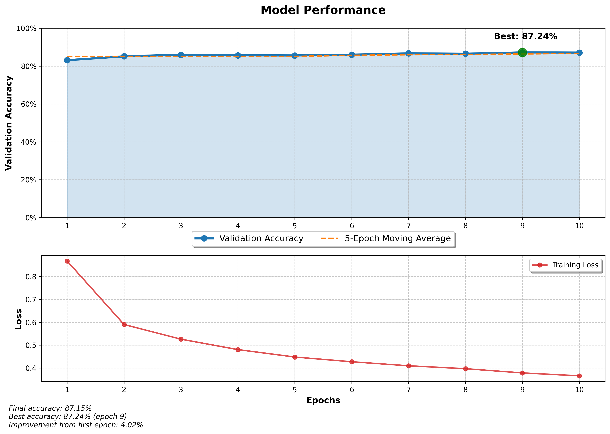
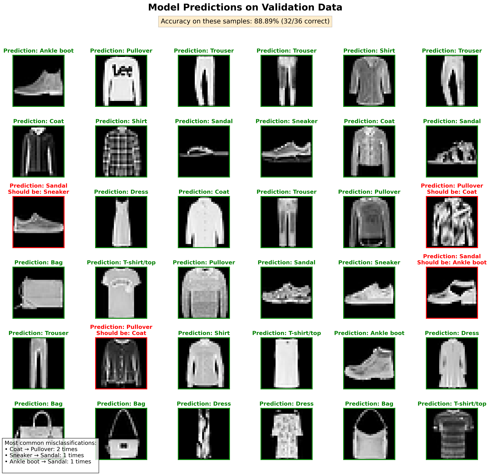

# Tinygrad - A Neural Network Framework Built From Scratch in NumPy

## Motivation

This project was born out of a desire to truly understand the inner workings of modern deep learning frameworks. While libraries like PyTorch and TensorFlow make it easy to build and train neural networks, their abstractions often hide many details which can lead to a false impression of mastery. Implementing such a framework from scratch forces one to deal with the details that are typically taken for granted. Using plain NumPy without additional libraries like OpenCV or SciPy keeps the abstraction level minimal and provides a deeper learning experience.

## Overview

Tinygrad is a neural network framework implemented purely in NumPy that provides a PyTorch-like experience for building and training deep learning models. It serves as both a learning tool and a demonstration of the core concepts that power modern deep learning.

### Key Achievements

- **Complete Autograd System**: Implemented automatic differentiation with computational graph tracking
- **Flexible Layer API**: Built modular components for constructing complex architectures with PyTorch-like syntax
- **Modern Optimizers**: Implemented sophisticated optimizers (SGD & AdamW) with proper weight decay and gradient clipping
- **Core Neural Network Components**: Created efficient implementations of Linear, Conv2D, Reshape, and Sequential layers
- **Activation Functions**: Implemented ReLU and Softmax with proper backpropagation
- **Regularization**: Added Dropout for reducing overfitting
- **Initialization Strategies**: Implemented Xavier initialization for stable training
- **Loss Functions**: Implemented Cross-Entropy loss with numerical stability improvements
- **Clean API Design**: Intuitive PyTorch-inspired interface with proper error handling

## Project Structure

```
nnx/
├── tinygrad/
│   ├── activations.py      # Activation functions (ReLU, Softmax)
│   ├── initialisation.py   # Weight initialization schemes (Xavier)
│   ├── layers.py           # Layer implementations (Linear, Conv2D, Sequential, etc.)
│   ├── loss.py             # Loss functions (Cross-Entropy)
│   ├── optimizer.py        # Optimization algorithms (SGD, AdamW)
│   └── tensor.py           # Core Tensor class with autograd capabilities
...                         
```

## Core Concepts

### Automatic Differentiation

The heart of Tinygrad is a custom implementation of reverse-mode automatic differentiation. Every tensor operation builds a computational graph that tracks how to compute gradients during backpropagation:

```python
def __add__(self, other: "Tensor") -> "Tensor":
    """Overloading for addition operation."""
    result = Tensor(
        self.data + other.data,
        requires_grad=(self.requires_grad or other.requires_grad),
    )

    if self.requires_grad or other.requires_grad:
        result.prev = {self, other}  # Track parent tensors

        def _backward() -> None:
            if result.grad is not None:
                # Handle gradient for self
                grad = result.grad
                if self.data.shape != result.grad.shape:
                    # Handle broadcasting
                    reduce_dims = tuple(
                        range(len(result.grad.shape) - len(self.data.shape)),
                    )
                    grad = np.sum(result.grad, axis=reduce_dims)
                self.grad = grad if self.grad is None else self.grad + grad
                
                # Similar logic for other tensor...

        result.register_backward(_backward)

    return result
```

### Neural Network Layers

Tinygrad implements core neural network layers with proper gradient computation:

- **Linear Layers**: Fully-connected layers with weight and bias parameters
- **Convolutional Layers**: 2D convolutions with stride and padding support
- **Dropout**: Stochastic regularization to prevent overfitting
- **Reshape**: Tensor reshaping while preserving gradient flow
- **Sequential**: Container for stacking multiple layers

### Optimizers

Tinygrad includes modern optimization algorithms:

- **SGD**: Simple stochastic gradient descent with gradient clipping
- **AdamW**: Adam with proper weight decay implementation (as per paper) without the learning rate scheudling

## Example Usage

### Building a Model

```python
from nnx.tinygrad.activations import ReLU, Softmax
from nnx.tinygrad.initialisation import xavier_uniform
from nnx.tinygrad.layers import Dropout, Linear, Reshape, Sequential

# Create a simple classifier for MNIST
model = Sequential(
    Reshape((batch_size, 784)),  # Flatten 28x28 images
    Linear(784, 256, initialiser=xavier_uniform, bias=True),
    ReLU(),
    Dropout(0.3),
    Linear(256, 128, initialiser=xavier_uniform, bias=True),
    ReLU(),
    Dropout(0.3),
    Linear(128, 10, initialiser=xavier_uniform, bias=True),
    Softmax()
)
```

### Training a Model

```python
from nnx.tinygrad.loss import cross_entropy_loss
from nnx.tinygrad.optimizer import AdamW
from nnx.tinygrad.tensor import Tensor

# Initialize optimizer
optimizer = AdamW(model.parameters)

data_loader = ... # logic for handling data

# Training loop
epochs = 10
for epoch in range(epochs):
    for images, targets in data_loader:
        # Convert to Tensors
        images_tensor = Tensor(images)
        targets_tensor = Tensor(targets)
        
        # Forward pass
        outputs = model(images_tensor)
        loss = cross_entropy_loss(outputs, targets_tensor)
        
        # Backward pass
        optimizer.zero_grad()
        loss.backward()
        optimizer.step()        
```

## End-to-End Example: Fashion MNIST Classification
To showcase the capabilities and correctness of the framework, an end-to-end example was implemented for the Fashion MNIST dataset. This example shows how the framework handles an entire machine learning workflow from model definition to training, evaluation, and visualization.

### Training and Evaluation
The example trains a multi-layer perceptron with dropout regularization using the AdamW optimizer. Despite being implemented purely in NumPy, the model achieves respectable accuracy on Fashion MNIST, demonstrating the effectiveness of the framework.

Key takeaways:

- Data loading and preprocessing
- Model definition using the `Sequential` API
- Loss calculation with `cross_entropy_loss`
- Optimization with `AdamW`
- Training loop implementation
- Validation of the performance on **unseen** data

#### Visualization of Performance

Several visualizations were added to monitor and analyze model performance. 



First, it was interesting to look at how the gradients behave over the course of the time. As apparent, gradients seem to converge early on in the training with layers being closer to the output having a higher magntitude than layers further away. When dealing with vanishing gradients exactly this is what also happens. Small gradients get even smaller and this is also why things such as norm layers help so much.



Validation accuracy and training loss over epochs. The steady improvement demonstrates successful learning despite the computational constraints of a pure NumPy implementation.




Sample predictions on the validation set. This visualization helps understand where the model succeeds and fails, identifying common misclassifications.


The complete example is available in `projects/tinygrad/Example.ipynb`. Run the Jupyter notebook to reproduce the results. The fixed seed should lead to reproducible results, though also influenced by hardware.


## What I Learned

Building Tinygrad provided invaluable insights into:

1. **Computation Graph Design**: How frameworks track operations and compute gradients
2. **Efficient Backpropagation**: The algorithms that make neural network training possible
3. **Layer Implementation Details**: The mathematical operations and gradient flows in standard layers
4. **Numerical Stability**: Techniques and tricks for preventing numerical issues (e.g., in Softmax and loss calculations)
5. **API Design**: Creating an intuitive interface that balances power and simplicity
6. **Tensor Operations**: How tensor manipulations (broadcasting, reshaping, etc.) affect gradient flow
7. **Optimization Techniques**: The practical implementations of modern optimizer algorithms

## Limitations and Future Work

- **Performance**: While educational, the NumPy implementation is significantly slower than optimized frameworks. Using the `Conv2D` for instance is slow and even when trying numba for acceleration it had no significant benefit. Nonetheless, as a mental gymnastic implementing the `Conv2D` with all nuances was still a great experience.
- **GPU Support**: Currently it is CPU-only. Extending it to use GPU acceleration is obviously possible but not that important to me.
- **Advanced Layers**: One could easily extend it to have more layers.
- **Advanced Loss Functions**: Additional loss functions which can be also used for tasks such as segmentation.

## Conclusion

Tinygrad demonstrates that the core concepts behind modern deep learning frameworks can be implemented from scratch with just NumPy. While not meant for production use, it serves as a valuable learning tool for understanding the internals of frameworks like PyTorch and TensorFlow.

By building this project, I've gained a much deeper understanding of automatic differentiation, neural network architecture design, and the challenges involved in creating a user-friendly deep learning API while also being exceptionally performant. This experience makes me value the great work behind PyTorch and JAX or Tensorflow even more!